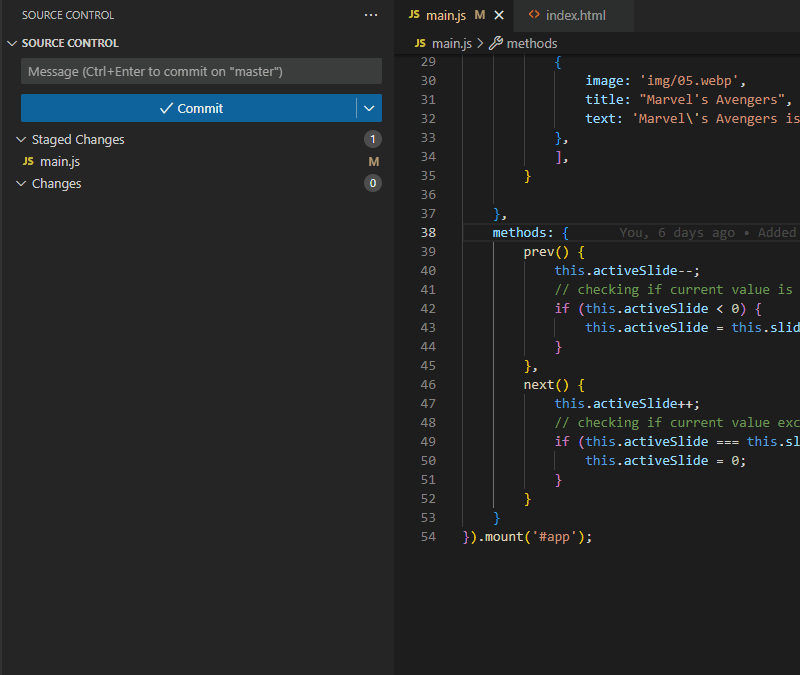

# commit-ai README

Commit AI is a simple VS Code extension that helps you write better commit messages. It uses OpenAI API to generate a commit suggestion based on the `git --diff --staged --minimal` command output.

## Features

Commit AI allows you to generate commit messages and descriptions using OpenAI API.
It's as simple as a click on the lightbulb icon on the Source Control Panel, or on *Request commit suggestion* in the context menu.

> Request commit suggestion using icon

> Request commit suggestion using menu item

## Commands
Using VS Code command palette `Ctrl+Shift+P` on Windows (`Cmd+Shift+P` on Mac) you can call the following commands:

* `[Commit AI] Request commit suggestion`: To request a suggestion based on your diff output
* `[Commit AI] Set API Key`: To save on your local workspace your OpenAI API key
* `[Commit AI] Clear API Key`: To remove your OpenAI API key from your local workspace

### Note

Your API key is stored locally leveraging VS Code *secret storage*.
We do not have access to your api key.

## Extension Settings

This extension contributes the following settings:

* `commit-ai.commitMessagePrompt`: The prompt used to request the commit suggestion.
* `commit-ai.maxTokens`: The maximum number of tokens available to the API for the commit suggestion.
* `commit-ai.temperature`: What sampling temperature to use, between 0 and 2. Higher value means more creativity from the API. Example: 0.8
* `commit-ai.gptModel`: What GPT model to use for completing the request. NOTE: not all models are available for certain endpoints. See [Models Endpoint Compatibility](https://platform.openai.com/docs/models/model-endpoint-compatibility)"
 * `commit-ai.gptApiEndpoint`: What endpoint to call for the request. NOTE: not all models are available for certain endpoints. See [Models Endpoint Compatibility](https://platform.openai.com/docs/models/model-endpoint-compatibility)"

## Known Issues

Seems like the extension keep asking for the OpenAI API key after you re-open VS Code.

## Release Notes

### 0.0.1
---

You can make request to the OpenAI API and select the model and endpoint you prefer.

## NOTE

This extension works by making request to the OpenAI API. In order to call those API you need to insert your personal API key.

You can create an account and request an API key using this link [OpenAI](https://platform.openai.com/)

This extension send the `git --diff --staged --minimal` output to OpenAI.

DO NOT USE THIS EXTENSION if you are working on sensitive information that should not be shared outside your workplace environment.

**Enjoy!**
